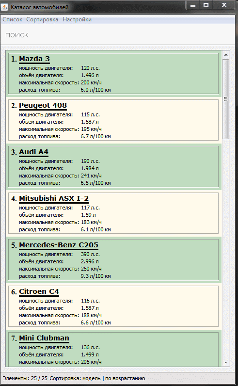

# Cars catalog

## Учебный проект

Задание: Создать приложение с графическим интерфейсом для указанной предметной области.

Класс «Автомобиль»: марка, модель, мощность, объем двигателя, максимальная
скорость, расход топлива.

В проекте должны быть реализованы следующие компоненты:

-   класс с полями и методами get и set, а также вывода на экран информации

-   обработка исключений

-   формы, меню, пользовательский интерфейс

-   обработку событий пользователя для меню

-   проверку вводимых данных с помощью регулярных выражений

-   запись массива объектов в файл и чтение данных из него

## Пример работы программы

